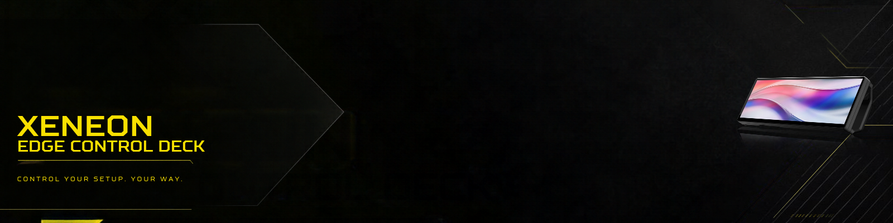

<p align="center">
  
</p>

<h1 align="center">XENEON Edge Control Deck</h1>

<p align="center">
  <a href="https://github.com/KayKaspers/Nova-Development-Framework"></a>
  <a href="https://github.com/KayKaspers/Core-Design-System"></a>
  
  
</p>

<p align="center"><strong>NDF-governed · CDS-designed · Human-controlled · Documentation-first</strong></p>

**DE:** XENEON Edge Control Deck ist ein öffentliches Projekt zur strukturierten Einrichtung, Gestaltung und Erweiterung des CORSAIR XENEON EDGE als interaktives Control Deck für Gaming, Streaming, Kommunikation und Systeminformationen. Das Projekt nutzt das Nova Development Framework (NDF) für Entwicklung und Governance sowie das Core Design System (CDS) für Design, UX und visuelle Konsistenz.

**EN:** XENEON Edge Control Deck is a public project for the structured setup, design and extension of the CORSAIR XENEON EDGE as an interactive control deck for gaming, streaming, communication and system information. The project uses the Nova Development Framework (NDF) for development governance and the Core Design System (CDS) for design, UX and visual consistency.

> [!NOTE]
> The project identity baseline was approved by the Human Maintainer in **XEE-WP-002A** after the CDS consumer contract and XENEON Product Profile were established.

## Contents / Inhalt

- **Start:** [What is XENEON Edge Control Deck?](#what-is-xeneon-edge-control-deck--was-ist-xeneon-edge-control-deck) · [Quick Start](#quick-start--schnellstart) · [Project Goals](#project-goals--projektziele)
- **Architecture / Architektur:** [Project Model](#project-model--projektmodell) · [NDF & CDS](#ndf--cds) · [CDS Consumer Model](#cds-consumer-model)
- **Use Cases / Anwendungsfälle:** [Star Citizen](#star-citizen) · [OBS Studio](#obs-studio) · [Discord](#discord) · [System & Telemetry](#system--telemetry)
- **Development / Entwicklung:** [Governed Workflow](#governed-workflow--gesteuerter-arbeitsablauf) · [Roles & Authority](#roles--authority--rollen--autorität) · [Work Packages](#work-packages)
- **Reference / Referenz:** [Security & Public Repository](#security--public-repository) · [Current Status](#current-status--aktueller-status) · [Documentation Map](#documentation-map--dokumentationsübersicht) · [Repository Structure](#repository-structure--repository-struktur) · [Language](#language--sprache)

## What is XENEON Edge Control Deck? / Was ist XENEON Edge Control Deck?

**DE:** Dieses Repository dokumentiert nicht nur eine einzelne persönliche Konfiguration. Ziel ist eine nachvollziehbare, reproduzierbare und erweiterbare Referenz für den CORSAIR XENEON EDGE.

Der XENEON EDGE wird als eigenständiger interaktiver **Control-Deck-Kanal** betrachtet. Hardware, Windows, CORSAIR iCUE und anwendungsspezifische Integrationen werden getrennt dokumentiert und schrittweise aufgebaut.

Der Schwerpunkt liegt zunächst auf:

- Star Citizen
- OBS Studio
- Discord
- Systeminformationen und Telemetrie
- lokalen Automationen
- Touch-orientierter Bedienung

**EN:** This repository does not merely document one personal configuration. Its goal is a traceable, reproducible and extensible reference implementation for the CORSAIR XENEON EDGE.

The XENEON EDGE is treated as a dedicated interactive **control-deck channel**. Hardware, Windows, CORSAIR iCUE and application-specific integrations are documented separately and introduced incrementally.

The initial focus is:

- Star Citizen
- OBS Studio
- Discord
- system information and telemetry
- local automation
- touch-oriented interaction

## Hardware Baseline / Hardware-Basis

The target hardware is the **CORSAIR XENEON EDGE 14.5-inch LCD touchscreen**.

Manufacturer-documented baseline:

- native resolution: **2560 × 720 (32:9)**
- refresh rate: **60 Hz**
- capacitive **5-point touch**
- display input via **HDMI** or **USB-C DisplayPort Alt Mode**
- horizontal and vertical orientation
- CORSAIR iCUE support

The project treats the XENEON EDGE both as:

1. a secondary Windows display; and
2. an interactive control surface.

This distinction is intentional: not every feature has to be implemented exclusively through iCUE.

```text
XENEON EDGE
    │
    ├── Windows Display
    ├── CORSAIR iCUE
    ├── Keyboard / Hotkey Actions
    ├── Local Automation
    ├── Application Interfaces
    └── Future Extensions
```

Hardware specifications are tracked against the manufacturer reference listed in `project-system/REFERENCES.md`.

## Quick Start / Schnellstart

**DE:** Das Projekt wird schrittweise aufgebaut. Nicht alle geplanten Funktionen existieren bereits.

**EN:** The project is built incrementally. Not all planned functionality exists yet.

| Path / Pfad | Goal / Ziel | Start here / Einstieg |
|---|---|---|
| **A** | Projekt verstehen / Understand the project | `README.md` |
| **B** | Roadmap und geplante Funktionen / Roadmap and planned functionality | `ROADMAP.md` |
| **C** | Projektidentität und Status / Project identity and status | `project-system/PROJECT_MANIFEST.md` |
| **D** | Projektregeln / Project rules | `project-system/PROJECT_PROFILE.md` |
| **E** | Aktuelle Arbeitspakete / Current Work Packages | `project-system/WORK_PACKAGE_QUEUE.md` |
| **F** | Externe Referenzen / External references | `project-system/REFERENCES.md` |
| **G** | Aktuellen Projektkontext verstehen / Understand current project context | `project-brain/PROJECT_BRAIN.md` |

## Project Goals / Projektziele

### Primary goals / Hauptziele

- reproducible XENEON EDGE setup / reproduzierbare Einrichtung
- clear separation of hardware, Windows, iCUE and application layers
- consistent touch interaction
- application-specific control decks
- documented configuration instead of untraceable local tweaks
- safe backup and recovery paths
- public, reusable documentation
- incremental extensibility
- CDS-based visual and interaction consistency

### Non-goals / Nicht-Ziele

The project is currently **not** intended to:

- replace CORSAIR iCUE;
- create a new general-purpose design system;
- move Star Citizen-, OBS- or Discord-specific functionality into CDS;
- claim formal CDS conformance without required evidence and authority;
- require the wider Core ecosystem as a runtime dependency;
- depend on cloud services for basic operation.

## Project Model / Projektmodell

```text
                         Human Maintainer
                              Kay
                               │
                   authority / acceptance
                               │
              ┌────────────────┴────────────────┐
              │                                 │
              ▼                                 ▼
   Nova Development Framework          Core Design System
             NDF                              CDS
              │                                 │
   Development Governance              Design / UX Authority
              │                                 │
              └────────────────┬────────────────┘
                               │
                               ▼
                   XENEON Edge Control Deck
                               │
              ┌────────────────┼─────────────────┐
              │                │                 │
              ▼                ▼                 ▼
        Star Citizen       OBS Studio         Discord
              │
              ├── Flight
              ├── Combat
              ├── Mining
              ├── Salvage
              └── Industrial / Cargo
```

## NDF & CDS

### Nova Development Framework

**NDF owns development governance.**

NDF defines:

- how work is scoped;
- how Work Packages are created;
- how acceptance criteria are defined;
- how implementation is reviewed;
- how evidence is recorded;
- where Human-Maintainer authority is required.

Reference: `KayKaspers/Nova-Development-Framework`

NDF does **not** define the visual design of the XENEON interface.

### Core Design System

**CDS owns design and UX direction.**

For this project CDS is used as the authority for:

- Foundations and Tokens
- Components
- Patterns and Experiences
- Channels and Communication
- Accessibility
- Product Profiles
- Evidence and Quality

Reference: `KayKaspers/Core-Design-System`

CDS does **not** define the development workflow or Git authority of this project.

### CDS Target-State Assumption

For the purpose of this project, the **target-state Core Design System is treated as fully operational and usable**.

```text
Foundations
    ↓
Components
    ↓
Patterns
    ↓
Channels
    ↓
XENEON Product Profile
    ↓
Consumer Extensions
```

> [!IMPORTANT]
> This is a project implementation assumption. It does **not** create a formal CDS adoption, maturity or conformance claim against the current CDS repository.

## CDS Consumer Model

XENEON Edge Control Deck is treated as a **CDS consumer**.

```text
CDS Core Foundation
       │
       ▼
XENEON Product Profile
       │
       ├── XENEON-specific interaction constraints
       ├── Touch interaction
       ├── Display geometry
       ├── Navigation
       └── Presentation rules
              │
              ▼
       Consumer Extensions
              │
       ┌──────┼────────┬──────────┐
       ▼      ▼        ▼          ▼
      SC     OBS    Discord    Telemetry
```

Application-specific functionality remains consumer-owned.

A Star Citizen control, OBS action or Discord action therefore does not become part of the CDS Core simply because this project uses it.

## Star Citizen

Star Citizen is expected to become the largest application-specific area of the project.

```text
STAR CITIZEN
│
├── FLIGHT
├── COMBAT
├── MINING
├── SALVAGE
├── INDUSTRIAL / CARGO
└── SYSTEM / UTILITY
```

Concrete bindings are defined only after hardware, Windows, iCUE and base interaction layers are validated.

## OBS Studio

The OBS integration is intended to provide frequently used streaming actions without forcing the user to leave the primary application.

Potential areas include:

- scene selection
- microphone control
- desktop audio
- recording
- streaming
- replay buffer
- source control
- status information

The exact integration method will be selected from evidenced capabilities rather than assumed.

## Discord

The Discord integration focuses on communication controls useful during gaming or streaming.

Potential functions include:

- microphone mute
- deafen
- Push-to-Talk related actions
- audio controls
- status feedback where technically available

Credentials, private server information and tokens must never be embedded in public project files.

## System & Telemetry

Potential information surfaces include:

- CPU metrics
- GPU metrics
- memory utilisation
- temperatures
- audio state
- network state
- application state
- time and system information

Telemetry is treated separately from control actions so that display-only functionality does not automatically gain control authority.

## Governed Workflow / Gesteuerter Arbeitsablauf

Development follows the NDF Governed Loop:

```text
PLAN → EXECUTE → VERIFY → EVALUATE
                               │
                               ▼
                     Human Maintainer Gate
```

| Stage | Responsibility |
|---|---|
| **PLAN** | Nova prepares scope, Work Package and acceptance criteria. |
| **EXECUTE** | The Human Maintainer performs local repository and physical-device implementation with Nova guidance. |
| **VERIFY** | Results, screenshots, configuration and behaviour are checked. |
| **EVALUATE** | Nova reviews the result against the Work Package. |
| **Human Maintainer Gate** | The Human Maintainer decides acceptance and performs Git operations. |

## Roles & Authority / Rollen & Autorität

| Role | Responsibility |
|---|---|
| **Nova (ChatGPT)** | Planning, architecture support, Work Package specification and review |
| **Implementation** | Local implementation on the PC and XENEON EDGE, currently performed directly by the Human Maintainer with Nova guidance |
| **Human Maintainer — Kay** | Final authority, acceptance, staging, commit, push, tags and releases |

> [!IMPORTANT]
> AI roles do not commit, push, tag or release this repository. All Git publication actions remain under Human-Maintainer control.

### Authority invariants / Autoritäts-Invarianten

```text
VERIFY != APPROVE
EVIDENCE != AUTHORITY
EXECUTED != ACCEPTED
NOVA_REVIEW != HUMAN_ACCEPTANCE
READY != RELEASED
PASS != PROMOTED
```

## Work Packages

Work is divided into small NDF-style Work Packages.

| Work Package | Scope | Status |
|---|---|---|
| **XEE-WP-001** | Project Bootstrap | COMPLETE |
| **XEE-WP-002** | CDS Consumer Integration and XENEON Product Profile | COMPLETE |
| **XEE-WP-002A** | Project Identity — Logo, Banner & Repository Branding | ACTIVE |
| **XEE-WP-003** | Hardware Baseline | PLANNED |
| **XEE-WP-004** | Windows Display and Touch Baseline | PLANNED |
| **XEE-WP-005** | iCUE and Firmware Baseline | PLANNED |
| **XEE-WP-006** | Base Control Deck | PLANNED |
| **XEE-WP-007** | Navigation and Deck Architecture | PLANNED |
| **XEE-WP-008** | Discord Integration | PLANNED |
| **XEE-WP-009** | OBS Studio Integration | PLANNED |
| **XEE-WP-010** | Star Citizen Flight | PLANNED |
| **XEE-WP-011** | Star Citizen Combat | PLANNED |
| **XEE-WP-012** | Star Citizen Mining | PLANNED |
| **XEE-WP-013** | Star Citizen Salvage | PLANNED |
| **XEE-WP-014** | Star Citizen Industrial / Cargo | PLANNED |
| **XEE-WP-015** | Telemetry and System Status | PLANNED |
| **XEE-WP-016** | CDS Visual and UX Review | PLANNED |
| **XEE-WP-017** | Backup, Export and Recovery | PLANNED |
| **XEE-WP-018** | Full System Verification | PLANNED |
| **XEE-WP-019** | Documentation and v1.0 Preparation | PLANNED |

The authoritative queue is maintained in `project-system/WORK_PACKAGE_QUEUE.md`.

## Security & Public Repository

This repository is **intentionally public**.

The following must never be committed:

- passwords
- API keys
- authentication tokens
- Discord tokens or webhooks
- OBS stream keys
- private credentials
- sensitive configuration exports
- screenshots containing credentials or personal information
- secrets embedded in logs
- unreviewed configuration files with unknown sensitive content

Before screenshots, exports or diagnostic information are published, they must be reviewed and sanitised.

```text
PUBLIC != SAFE BY DEFAULT
SANITISED != VERIFIED
EVIDENCE != AUTHORITY
```

See `SECURITY.md`.

## Implementation Constraints

Real hardware and software may not support every desired interaction.

Potential constraint sources include:

- CORSAIR iCUE
- Windows
- XENEON EDGE hardware behaviour
- Star Citizen
- OBS Studio
- Discord
- third-party local tools

A technical limitation must not silently redefine the design model. It is documented, classified and escalated where necessary.

## Current Status / Aktueller Status

| Item / Punkt | Status |
|---|---|
| Project state | **Design Foundation / Initial Development** |
| Repository | **Public** |
| Development governance | **Nova Development Framework (NDF) v1.1.0 baseline** |
| Design / UX foundation | **Core Design System (CDS)** |
| CDS usage model | **Target-state assumption** |
| Hardware | **CORSAIR XENEON EDGE available for implementation** |
| Current Work Package | **XEE-WP-002A — Project Identity, Logo, Banner & Repository Branding** |
| Branding | **Human-Maintainer approved baseline; repository integration active** |
| Release | **No project release yet** |
| Formal CDS conformance | **Not claimed** |
| License | **Open decision** |

## Documentation Map / Dokumentationsübersicht

| I want to … / Ich möchte … | Start here / Einstieg |
|---|---|
| understand the project / Projekt verstehen | `README.md` |
| see planned development / geplante Entwicklung sehen | `ROADMAP.md` |
| inspect project identity / Projektidentität prüfen | `project-system/PROJECT_MANIFEST.md` |
| understand project authority / Projektregeln verstehen | `project-system/PROJECT_PROFILE.md` |
| check current Work Packages / Work Packages prüfen | `project-system/WORK_PACKAGE_QUEUE.md` |
| see external references / Referenzen prüfen | `project-system/REFERENCES.md` |
| understand current project context / Projektkontext verstehen | `project-brain/PROJECT_BRAIN.md` |
| understand CDS integration / CDS-Integration verstehen | `design-system/CDS_INTEGRATION.md` |
| inspect the XENEON Product Profile / XENEON Product Profile prüfen | `design-system/XENEON_PRODUCT_PROFILE.md` |
| inspect component mapping / Komponenten-Mapping prüfen | `design-system/COMPONENT_MAPPING.md` |
| inspect pattern mapping / Pattern-Mapping prüfen | `design-system/PATTERN_MAPPING.md` |
| inspect consumer extensions / Consumer Extensions prüfen | `design-system/CONSUMER_EXTENSIONS.md` |
| inspect branding rules / Branding-Regeln prüfen | `branding/BRAND_GUIDE.md` |
| inspect branding assets / Branding-Assets prüfen | `branding/ASSET_MANIFEST.md` |
| inspect design-source provenance / Designquellen prüfen | `branding/SOURCE_PROVENANCE.md` |
| check public-repository safety / Public-Safety prüfen | `SECURITY.md` |

## Repository Structure / Repository-Struktur

Current governed structure:

```text
XENEON-Edge-Control-Deck/
├── README.md
├── ROADMAP.md
├── SECURITY.md
├── branding/
│   ├── README.md
│   ├── BRAND_GUIDE.md
│   ├── ASSET_MANIFEST.md
│   ├── SOURCE_PROVENANCE.md
│   └── assets/
│       └── png/
│           ├── xee-banner.png
│           ├── xee-social-preview.png
│           └── xee-logo-system.png
├── design-system/
│   ├── CDS_INTEGRATION.md
│   ├── XENEON_PRODUCT_PROFILE.md
│   ├── COMPONENT_MAPPING.md
│   ├── PATTERN_MAPPING.md
│   └── CONSUMER_EXTENSIONS.md
├── project-system/
│   ├── PROJECT_MANIFEST.md
│   ├── PROJECT_PROFILE.md
│   ├── WORK_PACKAGE_QUEUE.md
│   ├── REFERENCES.md
│   └── work-packages/
│       ├── XEE-WP-001.md
│       ├── XEE-WP-002.md
│       └── XEE-WP-002A.md
└── project-brain/
    └── PROJECT_BRAIN.md
```

Future structures such as `docs/`, `profiles/` and `evidence/` are introduced only by the Work Packages that own them. Empty directories are not created merely to make the repository look complete.

## Language / Sprache

**DE:** Die zentrale Projektdokumentation wird nach dem Vorbild von NDF grundsätzlich zweisprachig DE/EN geführt, wenn der zusätzliche Pflegeaufwand verhältnismäßig bleibt. Technische Begriffe wie Work Package, Human Maintainer, Consumer Extension und Product Profile bleiben konsistent.

**EN:** Following the NDF model, central project documentation is generally maintained bilingually in DE/EN where the additional maintenance cost remains reasonable. Technical terms such as Work Package, Human Maintainer, Consumer Extension and Product Profile remain consistent.

## Project References / Projektreferenzen

The project builds on:

- **Nova Development Framework (NDF)** — development governance
- **Core Design System (CDS)** — design and UX architecture
- **CORSAIR XENEON EDGE** — target hardware
- **CORSAIR iCUE** — primary vendor integration environment
- **Star Citizen** — gaming consumer
- **OBS Studio** — streaming consumer
- **Discord** — communication consumer

Revision-specific and external references are maintained in `project-system/REFERENCES.md`.

## Contributing / Mitwirken

The repository is public, but the project is currently Human-Maintainer-led.

Contributions should:

1. have a clearly defined purpose;
2. stay inside the relevant project scope;
3. preserve the NDF governance model;
4. respect CDS design boundaries;
5. contain no secrets or personal information;
6. document implementation limitations honestly.

Opening the project publicly does not remove Human-Maintainer authority over project scope, acceptance or releases.

## License / Lizenz

No project license has been selected yet.

Until a license is explicitly added, publication of the source does not automatically grant reuse rights beyond those provided by applicable law. A dedicated licensing decision is required before the first formal release.

## Independence / Unabhängigkeit

XENEON Edge Control Deck is an independent community project. It is not an official CORSAIR, Cloud Imperium Games, OBS Project or Discord product.

Product names and trademarks belong to their respective owners.
